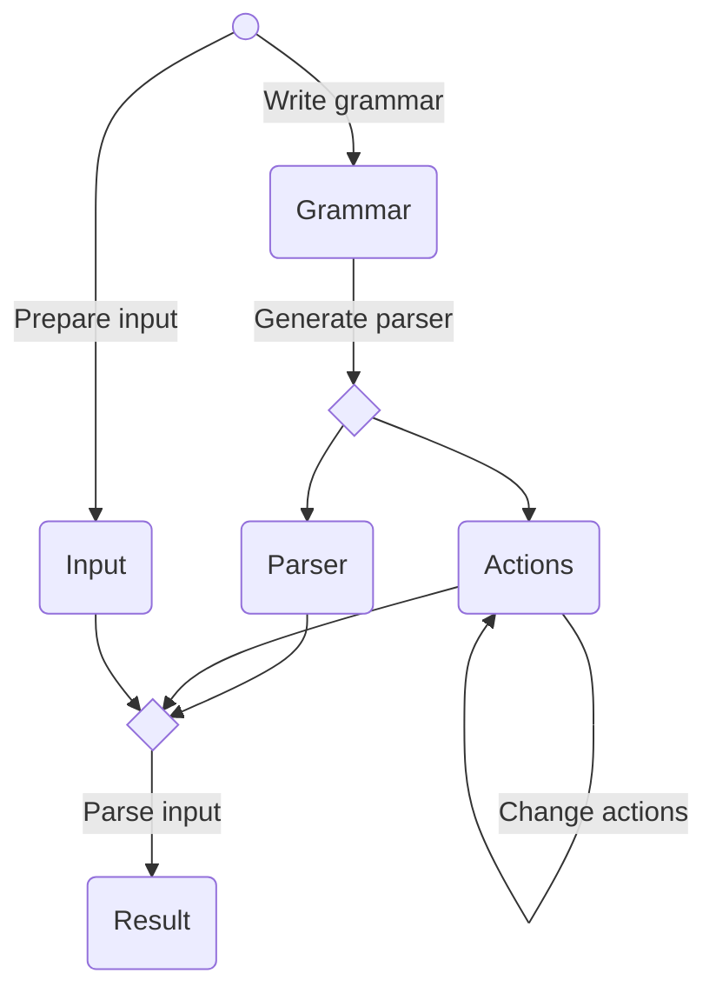

# Workflow

Our workflow is like the flowchart below.
We start from the circle at the top.

```mermaid
flowchart TD
  O(( ))
  G(Grammar)
  P(Parser)
  A(Actions)
  M1{ }
  I(Input)
  M2{ }
  R(Result)
  O -->|Write grammar| G
  G -->|Generate parser| M1
  M1 --> P & A
  A -->|Change actions| A
  O -->|Prepare input| I
  P & A & I --> M2
  M2 -->|Parse input| R
```

<!-- :arrow_right:  Next:  -->

:blue_book: Back: [Table of contents](./../README.md)
