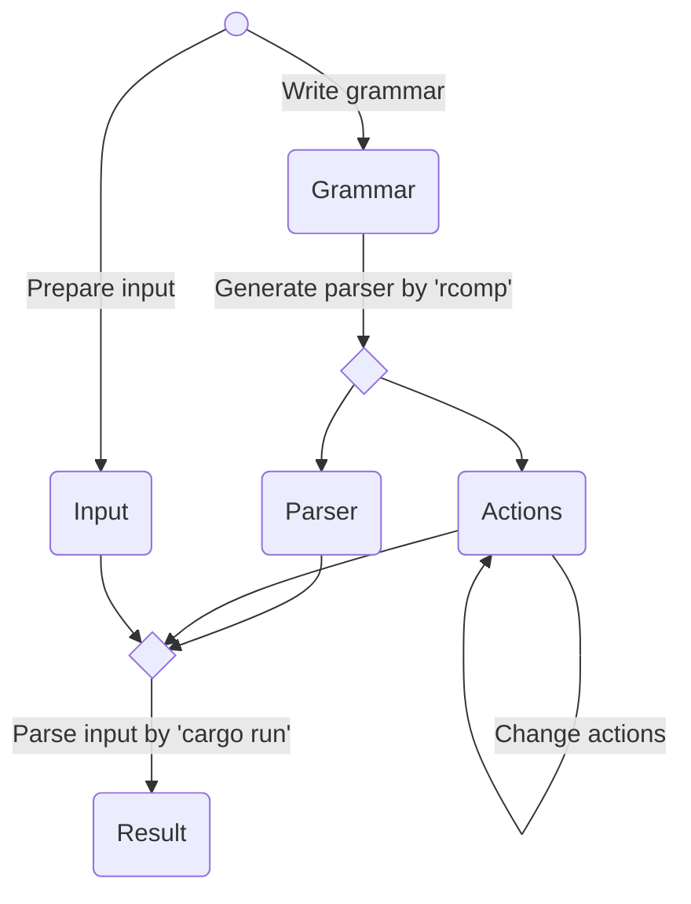

# Workflow

Our workflow is presented by the flowchart below.
The workflow starts from the circle at the top.

:arrow_right:  Next: [Grammar File Format](./grammar_file_format.md)

:blue_book: Back: [Table of contents](./../README.md)
